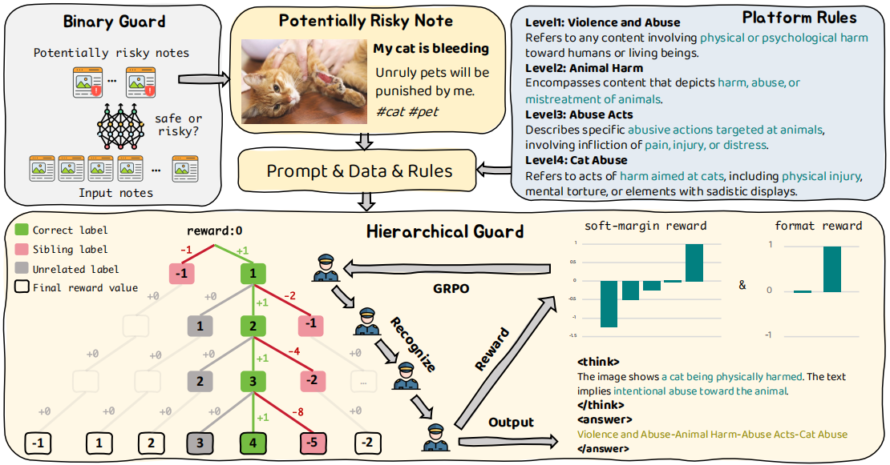

<h1 align="center">Hi-Guard: Towards Trustworthy Multimodal Moderation via Policy-Aligned Reasoning and Hierarchical Labeling</h1>

<p align="center">
  <b>
    Anqi Li<sup>1</sup>, Wenwei Jin<sup>2</sup>, Jintao Tong<sup>3</sup>, Pengda Qin<sup>2</sup>, Weijia Li<sup>2</sup>, Guo Lu<sup>1</sup>
  </b><br>
  <sup>1</sup>Shanghai Jiao Tong University &nbsp;&nbsp;
  <sup>2</sup>Xiaohongshu Inc. &nbsp;&nbsp;
  <sup>3</sup>Huazhong University of Science and Technology
</p>

<!-- --- -->


This repository contains the official implementation of **Hi-Guard**, a cascaded multimodal large language model (MLLM) framework designed to improve classification accuracy, interpretability, and policy alignment in real-world content moderation.


**📄 Paper**: [https://arxiv.org/pdf/2508.03296](https://arxiv.org/pdf/2508.03296)  
<!-- **📬 Contact**: Anqi Li (anqi.li@sjtu.edu.cn) -->

---
## 🧱 Framework Overview

The Hi-Guard framework consists of a cascaded moderation pipeline with two stages:

1. **Binary Guard**: Filters out safe content using lightweight classification.
2. **Hierarchical Guard**: Performs policy-aligned risk path generation on potentially risky content.

<p align="center">
  
</p> 

## 🔍 Highlights

- **Hierarchical Pipeline**: A two-stage moderation design that first filters safe content, then applies fine-grained risk classification to potentially risky cases.
- **Policy-Aligned Reasoning**: Models are prompted with real rule definitions and produce interpretable outputs with structured reasoning.
- **Soft-Margin Reward Optimization**: Fine-grained classification is optimized using a reward function that penalizes sibling-class confusion with increasing severity by depth.
- **Real-World Efficiency**: Reduces human review by 56.38% in deployment.

---

## 🏗️ Repository Structure

```
Hi-Guard/
├── assets/
├── src/
│   ├── rlvr/                # Stage2: RLVR + GRPO logic
│   ├── sft/                 # Stage1: Supervised fine-tuning 
├── setup1.sh                # Environment setup for stage1
├── setup2.sh                # Environment setup for stage2
└── README.md
```
---

<!-- ## ⚙️ Setup

Install dependencies via:

```bash
sh setup.sh
```

--- -->

## 🚀 Quick Start

Stage 1: Binary Classification (Safe vs. Risky)

```bash
sh setup1.sh
sh src/sft/train/2B_Binary-Guard.sh
```

Stage 2: Hierarchical Risk Path Prediction

```bash
sh setup2.sh
sh src/rlvr/train/7B_Hi-Guard.sh
```

---

<!-- ## 🧠 Method Overview

Hi-Guard addresses key challenges in moderation:
1. Misalignment between model decisions and platform policies
2. Opaque predictions lacking explanation
3. Confusion between fine-grained sibling categories

It resolves these via:
- **Policy-injected prompting** for rule-aware classification
- **Structured output** with `<think>` and `<answer>` format
- **Hierarchical taxonomy** enabling coarse-to-fine prediction
- **Soft-margin reward** to shape learning over sibling categories

All components are optimized using Group Relative Policy Optimization (GRPO).

--- -->

## 📊 Dataset

Hi-Guard uses a two-stage dataset from real-world moderation traffic:

| Stage | Task                  | #Samples | Risky:Safe Ratio |
|-------|-----------------------|----------|------------------|
| 1     | Binary Classification | 38k      | ~1:4             |
| 2     | Hierarchical Classification | 41k      | ~1:1             |

Only Stage 1 risky samples proceed to Stage 2 classification.

---

<!-- ## 🧪 Evaluation

Hi-Guard is evaluated on:
- **In-domain accuracy** (base set)
- **Generalization to unseen categories**
- **Reasoning preference by human moderators**

Hi-Guard outperforms SFT and RLVR baselines in accuracy, recall, and reasoning quality, while reducing GPU time by 22.7%.

--- -->

## 📦 Model Outputs

Structured predictions are formatted as:

```json
{
  "label_path": ["Minor", "Inappropriate Behavior", "Delinquent Social Atmosphere", "Underage Drinking"],
  "reasoning": "The image shows minors in a bar setting, holding drinks, which aligns with platform policy definition of underage drinking..."
}
```

---

<!-- ## 📌 Citation

```bibtex
@inproceedings{li2026hi-guard,
  title={Towards Trustworthy Multimodal Moderation via Policy-Aligned Reasoning and Hierarchical Labeling},
  author={Li, Anqi and Jin, Wenwei and Tong, Jintao and Qin, Pengda and Li, Weijia and Lu, Guo},
  booktitle={Proceedings of the 2026 ACM SIGKDD Conference on Knowledge Discovery and Data Mining (KDD)},
  year={2026}
}
```

--- -->

## 📝 License

For research purposes only. Please contact the authors for commercial licensing or dataset access.
